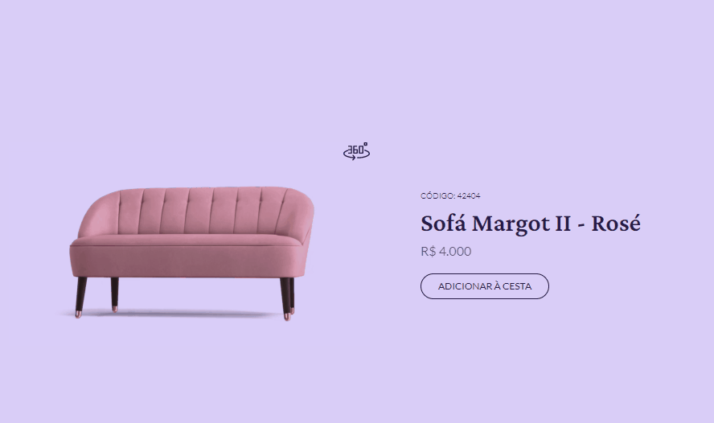

<h1 align="center">Projeto #boracodar</h1>

Este projeto é uma página web que apresenta um produto, o sofá Margot II - Rosé. A página inclui uma imagem do produto em 360° graus, informações sobre o produto e um botão para adicionar o produto à cesta de compras.

  <a href="#-tecnologias">Tecnologias</a>&nbsp;&nbsp;&nbsp;|&nbsp;&nbsp;&nbsp;
  <a href="#-projeto">Projeto</a>&nbsp;&nbsp;&nbsp;|&nbsp;&nbsp;&nbsp;
  <a href="#-layout">Layout</a>&nbsp;&nbsp;&nbsp;|&nbsp;&nbsp;&nbsp;
  <a href="#memo-licença">Licença</a>

  

 

## 🚀 Tecnologias

Esse projeto foi desenvolvido com as seguintes tecnologias:

- HTML e CSS
- JavaScript
- Git e Github
- Figma

## 💻 Projeto

O "Sofa Card Page" é um projeto desenvolvido como desafio #2 no boraCodar da Rocketseat. O projeto consiste em uma página de venda com um sofá Margot II - Rosé, onde a página exibe um botão de view 360º para analisar melhor os detalhes do sofá.
## 🔖 Layout

Você pode visualizar o layout do projeto através [DESSE LINK](https://jacquenunes.github.io/sofa-card-page/)

## Licença

Esse projeto está sob a licença MIT.

---

Feito por [Jacqueline Nunes](https://github.com/JacqueNunes). 
